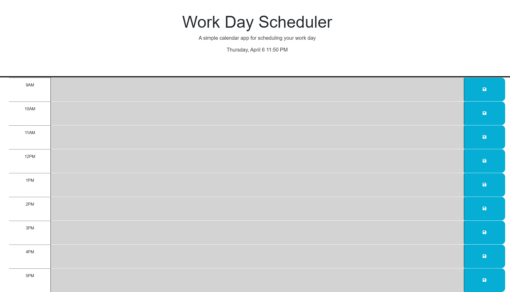

# 05 Third-Party APIs: Work Day Scheduler

## Descripion:

This is a simple calendar application that allows a user to save events for each hour of the day. This app will run in the browser and features dynamically updated HTML and CSS powered by jQuery.

It uses dayjs to get the date and time and will save events to local storage.

## Links:
This project can be viewed by going to [https://chrisosbii.github.io/05hCFwbo8Grs/](https://chrisosbii.github.io/05hCFwbo8Grs/)

## Screenshot:
